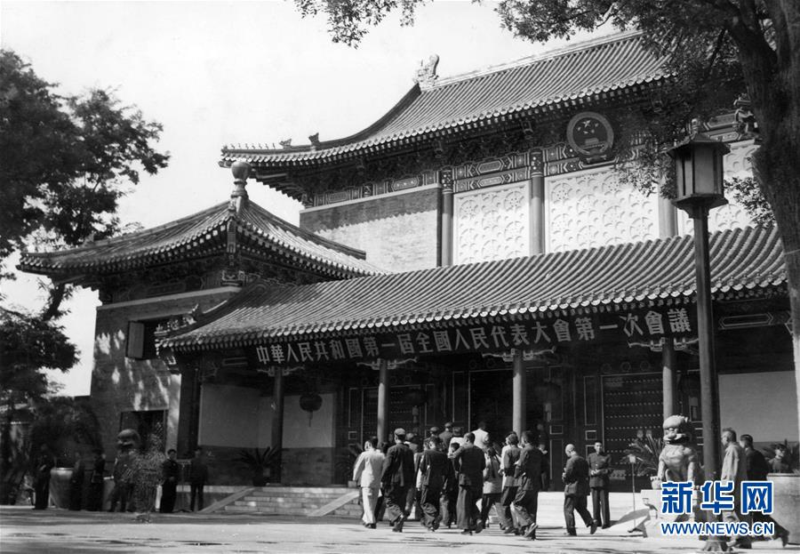

# 第1讲可用的1954年最小历史线

核对日期：2026年9月27日。范围：1949年临时宪法安排、1953年起草委员会、1954年草案讨论和审议通过。只为第一讲“人民当家作主怎样固定为制度”提供事实入口，不构成完整宪法史。

## 一、叙事问题先作一处修正

建议课堂问题写为：**“已经有《共同纲领》，为什么还要进一步制定宪法，把人民当家作主形成更完整的制度？”**

《共同纲领》已经具有临时宪法作用，不能暗示1949—1954年没有宪法性规则。也不能把它说成只有一般政策、没有国家机构和人民权利规定。1954年宪法是在它的基础上进一步发展。[《共同纲领》原文](http://www.cppcc.gov.cn/2011/12/16/ARTI1513309181327976.shtml)、[1954年宪法原文](http://www.cppcc.gov.cn/2011/09/06/ARTI1315304517625183.shtml)。

## 二、五个足够讲述的事实

### 1．1949年已有建国规则，也预设了下一步制度安排

1949年9月29日，中国人民政治协商会议第一届全体会议通过《共同纲领》。它规定国家性质、政权机关、权利等事项，在建国初期起临时宪法作用。第13条把全国人大召开前后分开：召开前由政协全体会议执行全国人大职权；召开后政协得就国家建设的重要事项提出建议。

可展示的短语是：**“在普选的全国人民代表大会召开以前”**。它让学生直接看见制度安排中的过渡性，而不是由教师空口说“临时”。

依据：[H01原文，第12—13条](http://www.cppcc.gov.cn/2011/12/16/ARTI1513309181327976.shtml)；临时宪法性质的官方历史说明见[H03第一部分](http://www.npc.gov.cn/npc/c12434/dzlfxzgcl70nlflc/202108/t20210824_313204.html)。

**讲法限度：**这种过渡性不等于《共同纲领》当时没有法律效力。第13条也不是一条“规定1954年某日必须制定宪法”的倒计时条款。

### 2．1953年成立的是起草委员会，承担草案工作

1953年1月13日，中央人民政府委员会成立以毛泽东为首的中华人民共和国宪法起草委员会。1954年3月，起草委员会接受中共中央提出的宪法草案初稿，并组织讨论。委员会的讨论、修改、报告工作与全国人大的最终制定、审议通过应明确区分。

依据：[H05，刘少奇1954年9月15日在一届全国人大一次会议上的宪法草案报告，书内第132页／电子书第142页](https://ebook.theorychina.org.cn/ebook/upload/storage/files/2022/07/28/11f643741b8857182ff6a8b5ada28b1a23891/files/basic-html/page142.html)。该页脚注说明报告原载1954年9月16日《人民日报》，1955年编入一届全国人大一次会议汇刊；本次读取的是官方电子书所收报告节选，未另取得当年报纸原版。

**讲法限度：**“宪法起草委员会”“中共中央的宪法起草小组”“中央人民政府委员会”“全国人民代表大会”不是同一机构。第一讲只保留必要的职责对照，不列全体成员名单，不把起草委员会说成最终审议通过机关。

### 3．草案先公布讨论，再经修改提交全国人大

1954年6月14日，中央人民政府委员会公布宪法草案，交付全国人民讨论。刘少奇的当年报告记载讨论持续两个多月，参加者一亿五千多万人；起草委员会依据意见再次修改，草案经9月9日中央人民政府委员会会议讨论通过后提交大会。

依据：[H05b，同一报告，书内第133页／电子书第143页](https://ebook.theorychina.org.cn/ebook/upload/storage/files/2022/07/28/11f643741b8857182ff6a8b5ada28b1a23891/files/basic-html/page143.html)。

**讲法限度：**如课堂容量紧，只讲“公布—讨论—修改—提交”四步；人数不是必背点。全国人民讨论不等于全民公决。6月公布的是草案，9月9日通过的也是送审草案，均不可说成正式宪法已经通过。

### 4．1954年9月20日，第一届全国人大第一次会议通过宪法

1954年宪法序言直接记载通过机关、日期和地点。其第2条明确国家权力属于人民，以及人民行使权力的机关；国家机构一章又规定机关的产生、职权和相互关系。由此可以转向本课的核心：人民当家作主要有能持续运行的制度和法律安排。

可展示序言短语：**“又是共同纲领的发展”**。这能避免把1954年讲成没有前史的突然开端。

依据：[H02，1954年宪法序言、第2条及国家机构章](http://www.cppcc.gov.cn/2011/09/06/ARTI1315304517625183.shtml)。

**讲法限度：**1954年条文用于历史说明，不能混写成现行宪法第2、3条。进入现行制度讲授时，应明确切换至现行宪法。

### 5．当年的讲话明确提出以根本法固定原则

毛泽东1954年6月14日在中央人民政府委员会第三十次会议上关于宪法草案的讲话，把宪法作为国家根本大法，说明其作用在于**“把人民民主和社会主义原则固定下来”**。

依据：[H06，韶山毛泽东同志纪念馆刊载《毛泽东文集》第六卷所收讲话](https://www.ssmzd.com/content/644343/83/12853157.html)，正文靠后“我们的宪法草案公布以后”一段；同页注释确认会议场合。中国人大网H03最后部分也引用了这一讲话。

**讲法限度：**“固定”是把基本原则确认为国家根本制度和规范，不表示制度内容永远不能修改，也不表示写进文本后效果会自动实现。可由此衔接“法律效力／实际效果”的区别。

## 三、可直接使用的史料照片

- 文件：`1954-09-15_代表进入怀仁堂_刘东鳌_新华社.jpg`；原始JPEG，900×623像素，111142字节。已实际打开查看，未修复、上色或生成画面。
- 发布页：[新华网图片频道，2019年9月15日发布](https://www.xinhuanet.com/politics/2019-09/15/c_1124998159.htm)。
- 原图地址：[官方图片资源](https://www.xinhuanet.com/politics/2019-09/15/1124998159_15685332401351n.jpg)。
- 准确图注：1954年9月15日，出席第一届全国人民代表大会第一次会议的代表进入中南海怀仁堂。新华社记者刘东鳌摄（资料照片）。
- 建议课件图注：**“1954年9月15日，代表进入怀仁堂。新华社记者刘东鳌摄。”**保留图片原有新华网标识和出处。
- **不能称为1954年9月20日表决通过宪法的现场照片。**图中只能确认会场外观和代表入场，不能据此补写具体人物身份、说话内容、内心活动、天气或会场里的动作。

## 四、供教师转接概念的简短讲法

以下是基于上述材料的教学组织，不是当事人的原话，也不是完整历史因果解释：

> 1949年并不是没有国家规则。《共同纲领》已经承担临时宪法的作用，并写下人民代表大会召开前后的安排。随着全国人大召开，制定宪法要进一步回答：人民怎样行使国家权力，国家机关怎样组成、做什么、对谁负责，公民有哪些基本权利。起草委员会准备和修改草案，人民参与讨论，最后由第一届全国人大第一次会议通过。宪法把国家的根本安排固定为制度，也为权力怎样运行、权利怎样保障提供共同依据。接下来我们看现行宪法，它用哪些具体规定回答这些问题。

建议只以四个时间点形成约3分钟的事实介绍，其余时间用于看《共同纲领》第13条短节录、辨明起草与通过、转接现行第2—3条。讲述无需虚构“某位代表的一天”，也无需扩展为1954年制宪史专题。

## 五、实际访问与阅读范围

- 已读取H01第12—13条及通过日期，H02序言和相关条文；保存网页全文不代表逐条通读。
- 已读取H03第一、第二部分及最后部分的1954年讲话引文；未对其1975年以后各节开展本轮核对。
- 已读取H05/H05b电子书两页的完整可见文字，未通读整部《刘少奇选集》或宪法草案报告全文。电子书脚注明确本书未收入报告第三部分。
- 已读取H06中起草讨论、草案与正式宪法、根本法作用等相关段落及注释；没有核对其全部历史引证。
- 已读取新华网原图说明并打开原图。图片只完成来源和画面核对，不等于Pro已经视觉审阅课件。
- H03属于官方历史说明；H01/H02是官方发布的历史规范文本；H05/H05b、H06是官方机构发布的当事人报告／讲话文本，性质应区分。

本目录保存HTML及其辅助纯文本，以便复核；辅助纯文本保留网页换行，引用时仍须对照HTML正文。失败访问和替代路径见[访问记录](访问记录.md)。
