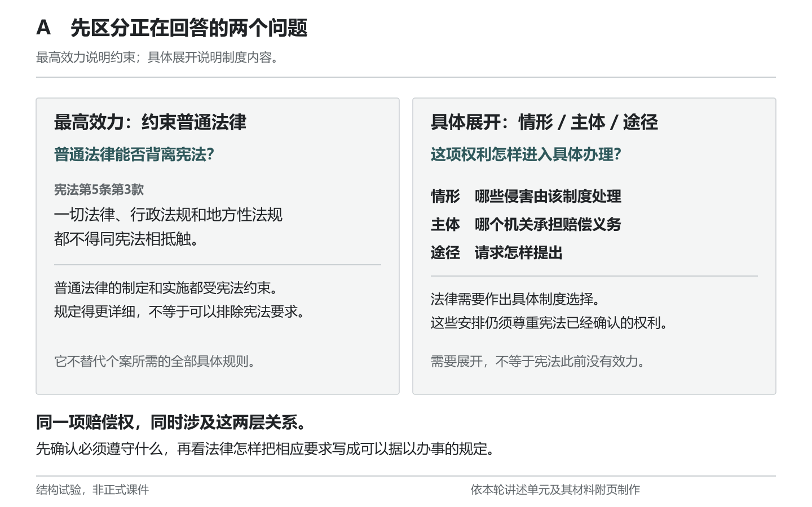
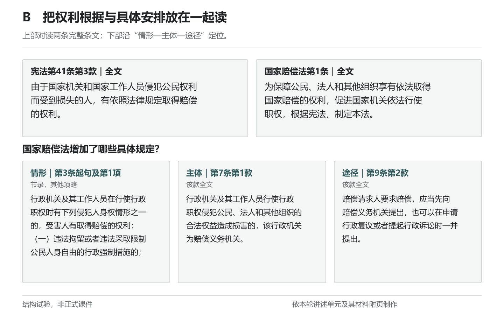
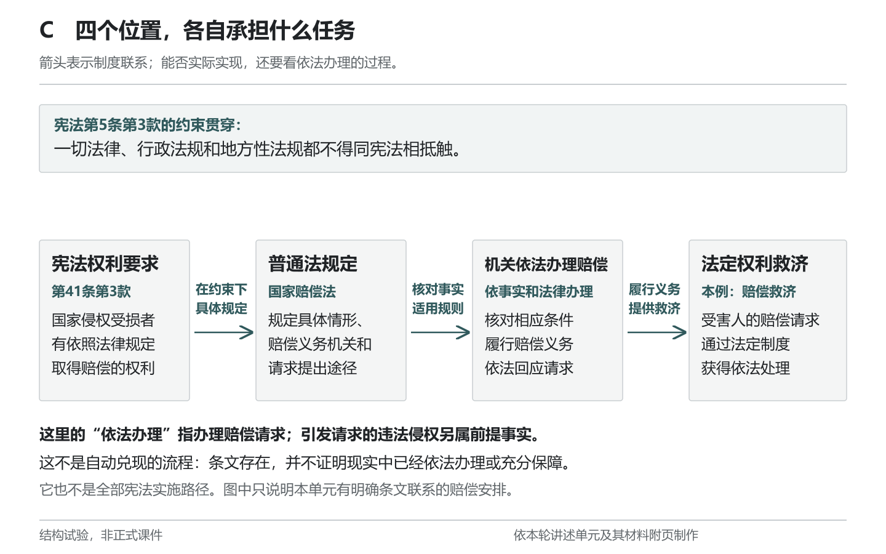
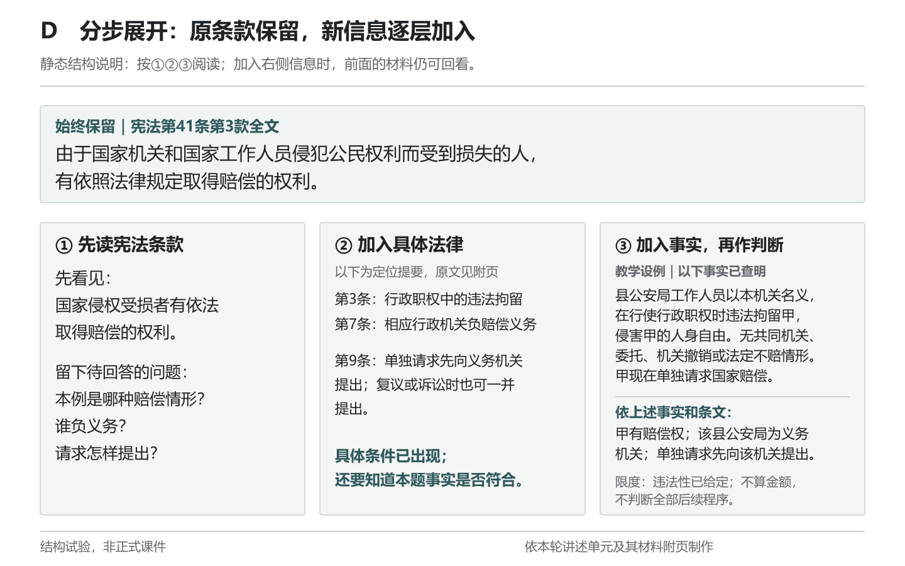

# 怎样让规范关系可见：四项结构试验

本轮只检验内容的排列和观看顺序。四张草图是四种可比较的结构，不是必须连续播放的四页正式课件；没有制作新的PPT。图片可在GitHub正文直接查看，每张另有可编辑SVG。

## 一、先保留必要文字，而不是急着画图

[SVG本体](视觉草图/A_两种问题.svg)

**解释任务：**让学生分开正在回答的两个问题。最高效力说明普通法律受到的约束；具体展开说明情形、义务主体与提出途径等制度内容。这适合对应讲述第三段，帮助学生回看“需要更具体的法律”为什么不等于“宪法原先没有效力”。

两栏保留第5条原文和三项具体问题，学生无须先理解新的比喻。它的代价是文字仍多，而且左右并列可能使两者看起来互不相干，因此底部必须回收到同一项赔偿权。教师应指出：同一部国家赔偿法既受约束，又作具体安排。

**选择条件：**用于辨析两种问题时可以保留；不能用这页替代后面实际的条文展开。若学生已经能够区分，口头回顾即可，不必额外停留读完整页。

## 二、并置条文让学生比较什么确实增加了

[SVG本体](视觉草图/B_法条并置与定位.svg)

**解释任务：**上部同时看第41条第3款与国家赔偿法第1条，随后向下查找具体情形、义务机关与提出途径。新材料改变的是学生对“具体化”的理解：它不再只是两部法律之间的名称关系，而是普通法律增加了可据以处理请求的信息。

第3条保留行政职权、人身权和违法拘留条件，第7条保留职权、合法权益及损害，第9条保留单独提出与复议、诉讼一并提出的两种安排。不能为了卡片整齐而只剩“第3条情形、第7条主体、第9条程序”几个标签。

**得失：**同屏有利于来回核对，不必凭记忆找前页；代价是下部字多、阅读路线不止一条。以1440×900原图近看未见截字，不能因此保证教室后排可读。材料C第2条仍在学生附页中，不在本图重复铺满。

**使用判断：**本图适合停留对读或讲评。讲述第四段已经给材料C两分钟静默阅读，教师此时不另讲新内容。若实际投影较小，应先显示上方两段、再放大下方每一组；完整附页必须一直可查。尚未制作这一动态版本。

## 三、关系图不能把制度联系画成自动结果

[SVG本体](视觉草图/C_制度联系.svg)

**解释任务：**在已经读过条文和设例之后，回看宪法要求、普通法律、机关依法办理和权利救济各自做什么。它适合第六段总结，不宜一开课便用四个框代替理由。

三段连线分别标明：在约束下作具体规定；核对事实、适用规则；履行义务、提供救济。图上不是同一种箭头反复复制同一种因果。第5条置于上方，提醒具体安排仍受宪法约束。

**需要当场说明的区别：**本题先有违法行政拘留，后有依法办理赔偿的要求。图中的第三格指后者，不能把前一个违法行为也涂成“依法履职”。末格是法定赔偿救济这一种权利保障方式，不代表所有基本权利保护，也不是所有宪法实施都必须经过这四步。

**观看后的修正：**初图箭头旁的任务文字离连线偏远，容易混入节点内容；已调整间距并重新查看。仍保留底部说明，因为箭头即使标得准确，也容易被读成“法律存在，结果就会发生”。本图没有实际履职数据。

## 四、分步展开必须保留前面的依据

[SVG本体](视觉草图/D_分步展开结构.svg)

**解释任务：**顶部第41条第3款始终保留，下方依次加入普通法律和设例事实。学生可回看：最初确认什么权利，后来哪条法律补了什么，事实是否满足条件。加入事实之后才有本题的有限结论，不能从法条直接跳到“公安机关应该赔”。

**与连续换页相比：**它减少丢失前文依据的风险，但累积后画面变密。中间栏是定位提要，明确不是原文，完整文字需回到附页或B图。

**实际局限：**这是一张静态结构说明，第三栏已经露出参考结论。如果直接把它当作学生作答页面，就会提前给出答案。因此当前成品只适合第五段作答后的回顾；若以后用于设问，须先隐藏第三栏结论，等作答后再显示。现在没有把这种设想记为已经完成的动态展示。

## 五、本轮选择与检查结论

不建议把四图全部逐页讲一遍。当前最有明确必要性的是B的条文对读和C的关系回收；A可作概念辨析时的支持，D可作讲评时的回看结构。最终取舍还取决于实际投影和学生材料使用，不以“图比文字高级”为依据。

制作分工逐图查看PNG并修正C，主线程再次查看四张最终图，另有只读审查核对图文与讲稿。八处法条引用与讲述材料附页逐字核对一致，四份SVG可解析。见[制作与检查记录](视觉草图/说明与检查.md)。这些检查说明当前图文可读且没有已发现的冲突；没有教室投影、连续播放或学习效果验证，也没有Pro视觉审阅。
