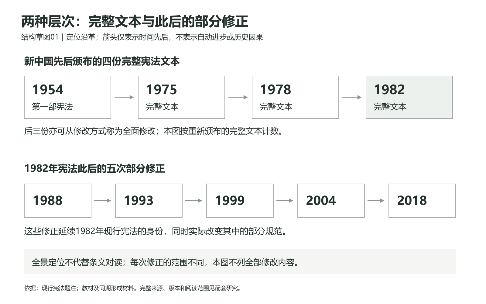
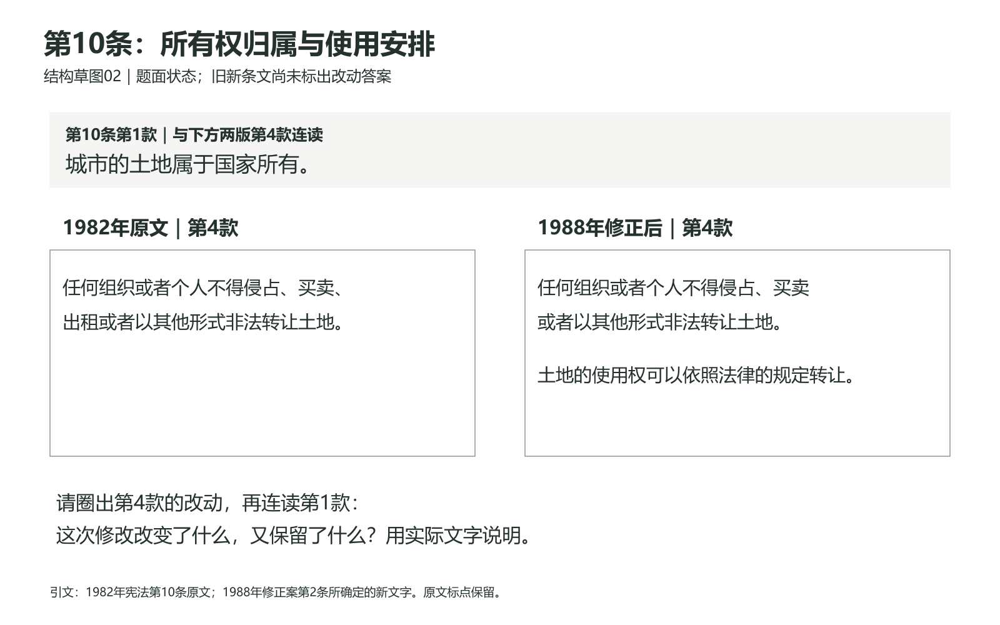
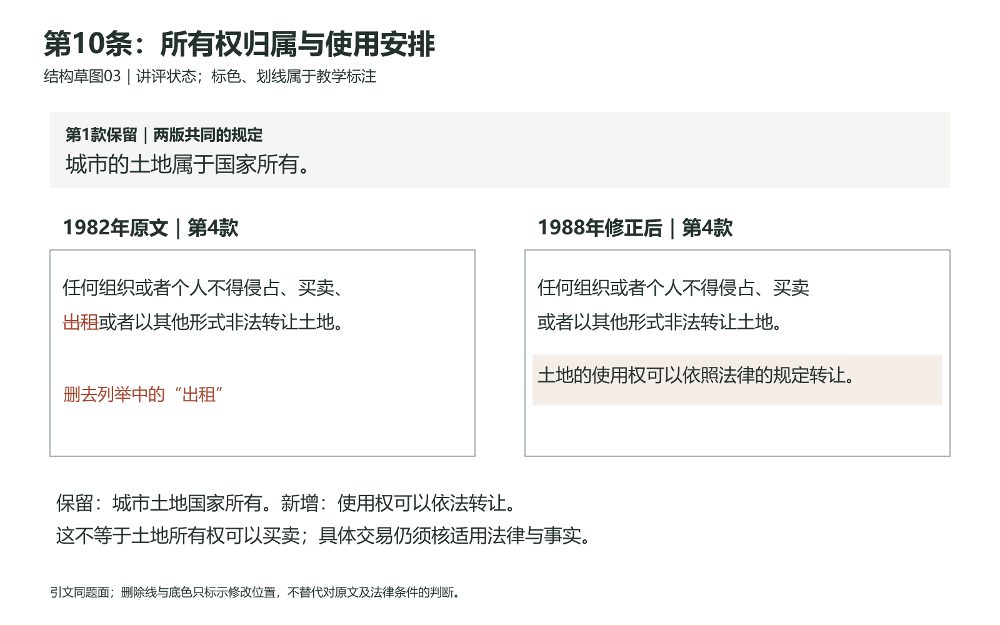

# 第二讲视觉组织与史料使用说明

2026年10月7日按确认取舍更新。对应[完整讲述](01_完整讲述.md)与[历史文本研究](研究/02_历史文本与形成材料.md)。本轮实际制作三张结构草图：一张沿革定位图、土地条款题面和讲评各一张，均有SVG与实际渲染PNG。下表说明整讲的展示分工，尚未把所有建议做成正式PPT。

## 一 屏幕帮助找到关系 史料册保留原文

第二讲的关键比较涉及不同年份的规范和文书。屏幕应帮助学生同时看到版本、相应条文和正在比较的问题；手中的史料册保留实际文字及材料身份，供停留、圈词和回看。教师讲述补充背景、解释制度关系和证据限度。这三项工作相互配合，不能把正文全搬上屏幕，也不能只留下条号让学生凭记忆作答。

| 讲述部分 | 建议的屏幕组织 | 学生手中保留什么 | 教师讲述与使用时机 |
|---|---|---|---|
| 一 1982年名称与现行题注 | 题注中的通过日期与后来修正日期，先不填三种文件的分类答案 | 现行题注与全景定位 | 提出为何仍称1982年宪法的问题；教师指读形成与修正的区别，不另设圈日期。这是提出整讲问题 |
| 二 近代起源 | 英、美、法三个并列小栏，各写形成中的具体问题与有限节点 | 简明全景及附页译意，原作和教师译意分开 | 教师解释王权与议会、州与联邦、权利与权力安排的不同问题；不画成三国依次进步的单链 |
| 三 中国近代探索 | 1912年第2、16、45条并置；按“主权根据／立法权／副署”定位 | 三条实际原文及简体转写说明；1908部分的教材概述身份 | 教师连续带读主权与分工，题1保留资料用途，不再独立全套写答 |
| 四 根据地与四份完整文本 | 使用图01；先指读上层四份完整文本，再指出下层将于后半堂展开 | 根据地、共同纲领及新中国节点的全景 | 说明区域性文件、临时宪法安排、完整文本与部分修正不是同一统计单位。图01是完整一张，未制作遮罩或动画 |
| 五 1982年形成材料 | 两个主要标签：“报告日期”“宪法通过并公布日期”；公报出版日只供教师备查 | 公报身份、报告与宪法的位置，原件定位 | 教师说明条文与报告的证据任务。按正文读报告和通过日期，不把备查的公报出版日加成新的课堂记忆点 |
| 六 人身自由与机关分工 | 三列1975、1978、1982原文，版本标题常驻；同题条款按相近高度放置 | 三组原文，包括1982年第37条与原第135条 | 先由教师示范1975至1978的差异；学生独立对读三列、组织题2的一项连贯解释；讲评时才标出新增禁令及具体关系。不给一张已填满的总结表代替原文 |
| 七 第一学时收束 | 保留刚用过的原文供回看 | 已有比较依据 | 教师回收已有判断，不追加页边写作 |
| 八 1988年土地修改 | 先用图02，再用图03；第10条第1款始终在上方 | 1982原文、1988修正案第2条及修正后文字 | 活动前提供实际原文及所有权、使用权的必要区别；学生完成改变/保留/条件的一项连贯解释后，才显示删除、新增与保留的讲评标注 |
| 九 五次部分修正 | 回到图01下层，指读本讲选用的内容示例 | 五次修正的简明定位表 | 教师说明示例不是每次修正全部内容；把1999、2004的新增原则联系到此前已有条文 |
| 十 2018监察入宪 | 三行对照：第3条机关列举、国务院职权旧新文字、新增监察机关条文 | 修正案第37、46、52条相关实际文字；形成说明 | 教师先带读一组相关修改，再说明组织、责任与职权相互牵连。此处以有依据的解释为主，不另外增加一轮同式问答 |
| 十一 修改程序 | 第64条第1款固定可见；另列“主体／文件／动作”的2018实例表 | 第64条与实际文件的日期、署名和行为 | 在监察改文后连续解释真实链条，题4保留回查，不另开对应任务。政治建议、拟稿、依法提请、审议、通过和公布分别标明；实例表不画成每次修宪都必经的同一细流程 |
| 十二 三种文件 | 1982完整宪法、1988修正案、2018初版监察法三个题名和必要题注；作答时只列材料 | 三份文件的相应原文、题注与问题 | 教师用已读过的三份文件回收关系，题5作资料，不另开分类/交换任务。教师仍须解释为何同一部现行宪法可经部分修正改变内容，不能只报分类名称 |
| 十三 收束与下一讲接口 | 回到一组学生刚用过的对照，显示出口说明要求 | 学生自己的圈词、答案与页边笔记 | 教师由具体依据回收改变与承接，不另设出口写作；不预先显示“全班已经掌握” |

两节均从本节0分钟起算，各45分钟。原E/C活动本轮退出，必要禁令/住宅解释吸收主线，人权长论证转备查。少量就近深化或保目标短讲只改变对应口述，不另造显示任务，使用后仍须各节容量复算。

## 二 已制作的沿革定位图

[查看PNG](视觉草图/01_完整文本与部分修正.png) · [查看SVG](视觉草图/01_完整文本与部分修正.svg)

上层按完整文本计数，下层标出1982年宪法此后的五次部分修正。两层分开，使学生能看见“1982年现行宪法”的身份与后来规范实际改变可以同时成立。箭头只表示时间先后；它不证明某项变化必然造成下一项，也不表示越往右保障效果越好。

图01适合在第四部分作全景定位，第九部分指读下层，第十二部分回收文本身份。它已经写明两种层次，所以第一部分开场标记题注时不提前使用本图；后面的题5仍需依据真实文件说明各自作用，不以刚看见年份和分类标题作为充分答案。

这张图没有包含近代探索、根据地和《共同纲领》的全部节点，它们由史料册全景与相应讲述承载。图中“四份”按新中国先后颁布的完整宪法文本计数；与教材从修改方式谈后三次全面修改相容。1978年公布后的1979、1980年局部修改另由材料说明，图不声称上层已经列全每一次修宪行为。

## 三 土地条款的两个真实显示状态

### 作答时显示图02

[题面PNG](视觉草图/02_土地条款_题面.png) · [题面SVG](视觉草图/02_土地条款_题面.svg)

第1款留在上方，旧新第4款同时可见。学生不用翻屏记住旧句，也不会只看到新增的使用权句而漏掉所有权规定。题面不标删除线、不加新增底色，也不预填修改意义。共同展示的第1款本身是作答材料；它能够约束过度结论，但没有替学生完成理由。

依本轮同步后的第八部分，教师在活动前提供原文与最小必要的概念区别，把“删去出租”“增加使用权依法转让”“保留城市土地国有”的答案性说明留到作答之后。画面与讲述都要遵守这一顺序，不能只把屏幕答案藏住，却提前口述全部结果。

### 听过回答后显示图03

[讲评PNG](视觉草图/03_土地条款_讲评.png) · [讲评SVG](视觉草图/03_土地条款_讲评.svg)

两版原文的位置和第1款不移动，讲评只增加三处信息：旧句“出租”的删除标记，新句使用权依法转让的底色，改变、保留及法律条件的简短解释。这样学生能把教师反馈放回自己刚才读的同一位置。删除线是教学标注，旧引文仍保留原字，不能把标过的旧句误当作另一个时期的正式文本。

图03只给本段需要的解释：所有权归属与使用权安排须区分，明确依法转让不等于任何交易当然合法。具体交易的适用法律与事实仍需另查。1988年同期经济改革背景由教师依据形成材料讲清，不在对读图中增加未经支持的单一事件因果。

## 四 为什么只做这三张

沿革定位最需要把统计层次分开；土地比较最需要旧新条文和共同前提同时可见。这两处若只投一段连续讲稿，会让学生自行承担寻找版本、记住旧句和辨认保留条款的工作，所以本轮先把它们做成实际草图。

人身自由、2018机关关系和修宪程序也需要并置，但它们的完整原文已经进入本轮内容与史料准备。后续正式制作时，应按表中关系组织相应页面，并核阅读容量；当前没有把尚未制作的全课展示状态写成已经交付。也不从这三张图推出第二讲应当固定多少页。

## 五 引文依据与实际检查

土地原文按[研究02第四节](研究/02_历史文本与形成材料.md)已经核过的文字输入：1982年宪法第10条第1、4款，原公报印刷855页／PDF物理7页；1988年修正案第2条所确定的第4款新文字。1988修正案此前有官方文本互核，本轮又看第3号公报77—79页原图，所选形成材料的原图缺口已补；不据此声称整期或全部过程穷尽。图中原文标点保留，换行和讲评标色为本课添加。

沿革依据本轮教材回读、现行宪法题注与研究02全景说明。画面内的“完整文本”“部分修正”是本课定位用语，不冒充历史条文原句。

三份SVG已解析并实际渲染为1600×1000 PNG，逐张打开查看。首次渲染中发现新增使用权句被人为分成短尾行，已合为一行，题面与讲评同步重渲并复看；正式引文字符未删改。检查了题面与讲评的原文一致、来源身份、标注位置、字距和边界，未见遮挡或截字。PNG来自这些结构SVG，不是正式PPT截图。

本轮没有真人试读、学生观察、后排投影或原生PowerPoint检查。三图能够供教师和Pro审查展示关系，尚不能证明学生注意会按预想移动或比较一定成功。实际使用时应看学生是否能同时说明改变、保留与条件，再判断需要怎样调整讲述和画面。

## 六 本轮实看与新增论证的显示关系

2026年10月6日重新打开三张1600×1000实际PNG，核题面与讲评分开、原文可读、所有权与使用权位置及年份关系。画面没有旧课时标签；现有文字无需为时间口径重绘。新增实质解释由讲稿和史料册承担：学生册补充材料页增加1946转引、1982报告原句和国家任务；前轮材料五增第124条末款；本轮改为随讲带读，不沿用20秒独立活动；讲评后解释效率、分工、流转条件及修改层次。图03不承担证明全部制度效果的任务。

本轮保留三图及SVG，不声称制作新的正式PPT。后续真实课件若改变阅读、切换或活动，仍须重新分节核算。

## 七、阶段B的新增显示关系与实际边界

本轮只改拟展示组织，保留三份现有SVG/PNG，不新增正式PPT。土地题面与讲评的旧新文字未改；新增1988土地管理法短款放史料册材料三，教师在土地论证后带读。拟展示可在土地比较后保留宪法新句并同时列出该短款及其历史版本，突出“根本许可—法律修改—具体办法继续规定”。不加法律全文、审批路线或日期独立任务，不用无标注箭头冒充不同效力。

监察改文与第64条在连续单元中切换；第64条两种提议主体固定可查，2018政治建议与法定行为以动作说明，资料表中的细日程不逐一考记忆。三份文件的收束复用已经出现的文字，不再给同桌交换计时。今后制作真实页面，须把这些拟展示变成可核实页号与翻页时机，再重算两节；当前不宣称正式稿屏已验证。

本轮没有重新渲染三张既有草图；它们的原文未改，2026年10月6日实际看图记录保留其日期，不写成本轮又看过。新土地原公报核读图属于来源证据，不是第二讲正式课件预览。
