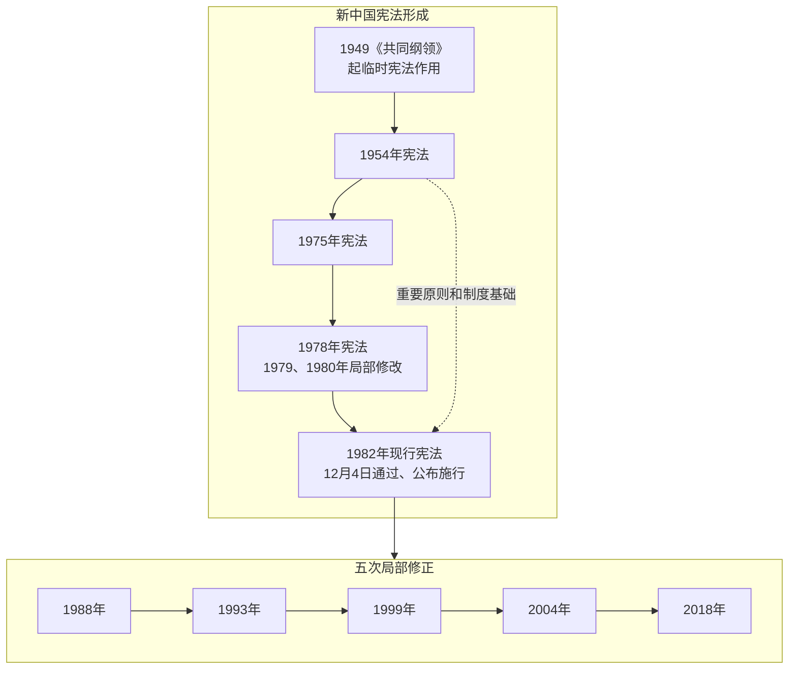
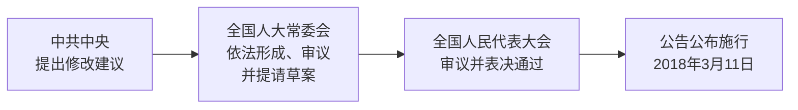

# 第二讲　90/100分钟安排与必要视觉组织

本讲仍是两学时。核心以2×45分钟编排，课间另计；若实际为2×50分钟，按本页条件性用法增加两段各5分钟。时间均为备课预算，没有真人试讲计时或学习效果数据。

## 一、90分钟核心安排

“教师讲述与讲评”包括01中的参考解释，不能在该栏之外再追加一遍03全文。“学生时间”包含静默读、独立写、同桌说明和被邀请的口头回答。指读/板书/转场用于翻页、找句、画线和回看关系；机动用于实际疑问，未发生疑问时可回看并修正已有作答，不添加新知识点。

| 时段 | 内容与当堂动作 | 教师讲述与讲评 | 学生时间 | 指读/板书/转场 | 机动 | 合计 |
|---|---|---:|---:|---:|---:|---:|
| 0—3 | 第一讲接口、现行题注、三条线 | 2 | 0.5 | 0.5 | 0 | 3 |
| 3—14 | 近代背景、英美法不同路径、社会主义宪法位置 | 7 | 1 | 2 | 1 | 11 |
| 14—28 | 中国探索；任务1；根据地产生关系指读 | 7 | 3.25 | 2.75 | 1 | 14 |
| 28—35 | 四部宪法、任务2、1982与五次修正分支 | 4 | 1.5 | 1 | 0.5 | 7 |
| 35—45 | 1982形成背景、过程、原序言与第5条 | 5.5 | 1.5 | 2.5 | 0.5 | 10 |
| **第一学时** | **45分钟处课间，课间不计** | **25.5** | **7.75** | **8.75** | **3** | **45** |
| 45—57 | 1978/1982目录及原条文；任务3 | 5.5 | 5 | 1 | 0.5 | 12 |
| 57—62 | 五次修正题注、版本归属 | 2.5 | 1 | 1 | 0.5 | 5 |
| 62—78 | 2018真实文本前后比较；任务4 | 7.5 | 7 | 1 | 0.5 | 16 |
| 78—86 | 第64条提议及2018实际过程；任务5 | 4 | 2.5 | 1 | 0.5 | 8 |
| 86—90 | 任务6三句话、讲评、第三讲接口 | 2 | 1.5 | 0 | 0.5 | 4 |
| **第二学时** | **核心结束** | **21.5** | **17** | **4** | **2.5** | **45** |
| **全讲** |  | **47** | **24.75** | **12.75** | **5.5** | **90** |

新中国宪法及现行宪法发展占28—90分钟，共62分钟，含读答、讲评和收束；1982形成与文本对读占22分钟，2018案例与提议程序占24分钟。前两条历史线保留课堂正文，不平均铺年代，也没有把必讲内容转移到100分钟方案。

### 容量怎样理解

01的正文是可连续讲述的完整文本，不要求教师把不朗读提示、来源编号和题目逐字重复读一遍。实际汉字统计和敏感性估算见[06检查记录](06_检查与接续记录.md)。每分钟字数仅用于检查容量，不能写成统一正常语速或真人用时。学生在静默阅读时教师停止讲解，先作答后讲评。

超时优先处理：

1. 收短重复口头反馈，同一答案只解释一次；03中的教师备查不自动成为必讲正文。
2. 近代部分不增加国家和制度清单，中国近代部分不补讲全部民国文件；原稿没有逐一讲授要求。
3. 不重复第一讲1949—1954照片导入和60%门槛题；第一次只用约1分钟承接。
4. 保留任务3的独立写作、任务4前后原文阅读及任务5主体辨认；如仍明显超时，记录具体段落供下一轮修改，不靠加快全课语速补回。

核心结束仍有余量时，先请学生用已有材料修改一个不准确回答，或回指主时间轴；100分钟深化内容仅在实际课时允许时使用。

## 二、100分钟条件性用法

| 插入位置 | 增加内容 | 分钟 | 时间关系 |
|---|---|---:|---|
| 核心35—45分钟段结束后、课间前 | E1：1982原文与2004增加的人权句，核版本并保留原有权利保障认识 | 5 | 第一学时50分钟；课间另计 |
| 核心任务4完成后、任务5前 | E2：纠正“只加一个部门”和“地位即具体权限”两处判断 | 5 | 第二学时50分钟 |
| **总计** | **原90分钟核心＋两段深化** | **100** | **不新增必讲历史线或另一案例** |

E1、E2材料在02末尾，实际教师解释在03末尾。每段均为独立思考1分钟、同桌比较1分钟、学生说明1分钟、教师讲评与回收2分钟；不是将额外10分钟全变为教师讲授。

## 三、视觉草图1：主线与修正支线

这是供黑板或后续正式课件使用的内容草图，GitHub支持时可直接显示。箭头只表示时间和文本发展次序，不单独证明因果或实施效果。四部宪法明确保留；1988—2018从1982节点另起修正支线。

已核验的本地渲染：[PNG](预览/形成主线与修正支线.png)／[SVG](预览/形成主线与修正支线.svg)。该图供备课阅读，课堂仍按下述分步呈现，不把长图直接等同已验收的投影片。

课堂分两次画：先出现1949至1982，完成任务2；再从1982向下或向右分支显示五次修正。投影宽度不够时，五次修正排成第二行，不缩小全部字号。学生材料保留表格供不支持图形的平台阅读。

## 四、视觉草图2：只比较变化处，并保留未变关系

第一次展示材料E1时，不提前用颜色标出答案。学生圈画后，讲评再显示：

| 新增的组成 | 保留且适用于新机关的关系 |
|---|---|
| 在第3条第三款增加“监察机关” | 由人民代表大会产生；对它负责；受它监督 |
| 第123条确定国家监察机关性质 | 第126条进一步规定负责关系 |

此图不以同一箭头兼表示产生、负责、监督三个不同方向；课堂直接用完整主客体句，避免第一讲第7页旧图式的歧义。第89/107条删词是配套证据，作为材料E3小框，不画成“所有监察职能从单个机关机械搬走”的完整组织图。第124条末款放在图下，提示具体组织和职权继续查法律。

## 五、视觉草图3：过程不同，主体和动作不同

已核验的本地渲染：[PNG](预览/2018实际修正过程.png)／[SVG](预览/2018实际修正过程.svg)。

标题应写“2018年实际过程（简图）”，不是所有历史时期的唯一固定程序。第64条的两种法定提议入口另用一行文字并列；此图只画本次走过的常委会路径，不暗示必须五分之一代表同时提议。不得将政治建议标为修正已生效，也不把报告说明人当作法定提议主体。

本轮只完成内容草图及文本对照，没有正式PPT、Office或课堂投影验收。后续制作应在内容审阅后进行，不因现有第一讲36页而预设第二讲页数。
